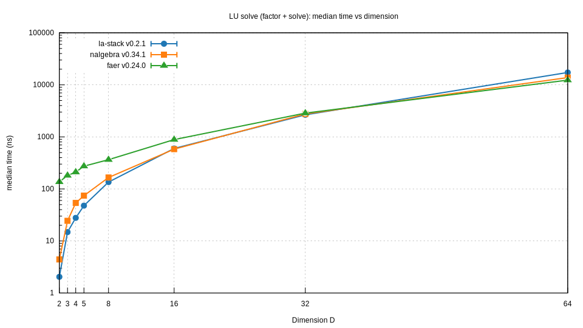

# la-stack

[](https://crates.io/crates/la-stack)
[](https://crates.io/crates/la-stack)
[](./LICENSE)
[](https://docs.rs/la-stack)
[](https://github.com/acgetchell/la-stack/actions/workflows/ci.yml)
[](https://github.com/acgetchell/la-stack/actions/workflows/rust-clippy.yml)
[](https://codecov.io/gh/acgetchell/la-stack)
[](https://github.com/acgetchell/la-stack/actions/workflows/audit.yml)
[](https://github.com/acgetchell/la-stack/actions/workflows/codacy.yml)

Fast, stack-allocated linear algebra for fixed dimensions in Rust.

This crate grew from the need to support [`delaunay`](https://crates.io/crates/delaunay) with fast, stack-allocated linear algebra primitives and algorithms
while keeping the API intentionally small and explicit.

## 📐 Introduction

`la-stack` provides a handful of const-generic, stack-backed building blocks:

- `Vector<const D: usize>` for fixed-length vectors (`[f64; D]` today)
- `Matrix<const D: usize>` for fixed-size square matrices (`[[f64; D]; D]` today)
- `Lu<const D: usize>` for LU factorization with partial pivoting (solve + det)

## ✨ Design goals

- ✅ `Copy` types where possible
- ✅ Const-generic dimensions (no dynamic sizes)
- ✅ Explicit algorithms (LU, solve, determinant)
- ✅ No runtime dependencies (dev-dependencies are for contributors only)
- ✅ Stack storage only (no heap allocation in core types)
- ✅ `unsafe` forbidden

## 🚫 Anti-goals

- Bare-metal performance: see [`blas-src`](https://crates.io/crates/blas-src), [`lapack-src`](https://crates.io/crates/lapack-src), [`openblas-src`](https://crates.io/crates/openblas-src)
- Comprehensive: use [`nalgebra`](https://crates.io/crates/nalgebra) if you need a full-featured library
- Large matrices/dimensions with parallelism: use [`faer`](https://crates.io/crates/faer) if you need this

## 🔢 Scalar types

Today, the core types are implemented for `f64`. The intent is to support `f32` and `f64`
(and `f128` if/when Rust gains a stable primitive for it). Longer term, we may add optional
arbitrary-precision support (e.g. via `rug`) depending on performance.

## 🚀 Quickstart

Add this to your `Cargo.toml`:

```toml
[dependencies]
la-stack = "0.1"
```

Solve a 5×5 system via LU:

```rust
use la_stack::prelude::*;

// This system requires pivoting (a[0][0] = 0), so it's a good LU demo.
// A = J - I: zeros on diagonal, ones elsewhere.
let a = Matrix::<5>::from_rows([
    [0.0, 1.0, 1.0, 1.0, 1.0],
    [1.0, 0.0, 1.0, 1.0, 1.0],
    [1.0, 1.0, 0.0, 1.0, 1.0],
    [1.0, 1.0, 1.0, 0.0, 1.0],
    [1.0, 1.0, 1.0, 1.0, 0.0],
]);

let b = Vector::<5>::new([14.0, 13.0, 12.0, 11.0, 10.0]);

let lu = a.lu(DEFAULT_PIVOT_TOL).unwrap();
let x = lu.solve_vec(b).unwrap().into_array();

// Floating-point rounding is expected; compare with a tolerance.
let expected = [1.0, 2.0, 3.0, 4.0, 5.0];
for (x_i, e_i) in x.iter().zip(expected.iter()) {
    assert!((*x_i - *e_i).abs() <= 1e-12);
}
```

## 🧩 API at a glance

| Type | Storage | Purpose | Key methods |
|---|---|---|---|
| `Vector<D>` | `[f64; D]` | Fixed-length vector | `new`, `zero`, `dot`, `norm2_sq` |
| `Matrix<D>` | `[[f64; D]; D]` | Fixed-size square matrix | `from_rows`, `zero`, `identity`, `lu`, `det` |
| `Lu<D>` | `Matrix<D>` + pivot array | Factorization for solves/det | `solve_vec`, `det` |

Storage shown above reflects the current `f64` implementation.

## 📋 Examples

The `examples/` directory contains small, runnable programs:

```bash
just examples
# or:
cargo run --example solve_5x5
cargo run --example det_5x5
```

## 🤝 Contributing

A short contributor workflow:

```bash
cargo install just
just ci           # lint + fast tests + bench compile
just commit-check # lint + all tests + examples
```

For the full set of developer commands, see `just --list` and `WARP.md`.

## 📊 Benchmarks (vs nalgebra/faer)



Raw data: [docs/assets/bench/vs_linalg_lu_solve_median.csv](docs/assets/bench/vs_linalg_lu_solve_median.csv)

Summary (median time; lower is better). The “la-stack vs nalgebra/faer” columns show the % time reduction relative to each baseline (positive = la-stack faster):

<!-- BENCH_TABLE:lu_solve:median:new:BEGIN -->
| D | la-stack median (ns) | nalgebra median (ns) | faer median (ns) | la-stack vs nalgebra | la-stack vs faer |
|---:|--------------------:|--------------------:|----------------:|---------------------:|----------------:|
| 2 | 2.043 | 18.278 | 159.281 | +88.8% | +98.7% |
| 3 | 13.449 | 23.337 | 196.591 | +42.4% | +93.2% |
| 4 | 27.807 | 54.199 | 226.222 | +48.7% | +87.7% |
| 5 | 46.075 | 73.548 | 290.914 | +37.4% | +84.2% |
| 8 | 138.187 | 177.453 | 379.886 | +22.1% | +63.6% |
| 16 | 626.078 | 594.055 | 897.044 | -5.4% | +30.2% |
| 32 | 2,684.696 | 2,502.031 | 2,909.466 | -7.3% | +7.7% |
| 64 | 16,721.576 | 14,875.770 | 12,493.628 | -12.4% | -33.8% |
<!-- BENCH_TABLE:lu_solve:median:new:END -->

## 📄 License

BSD 3-Clause License. See [LICENSE](./LICENSE).
