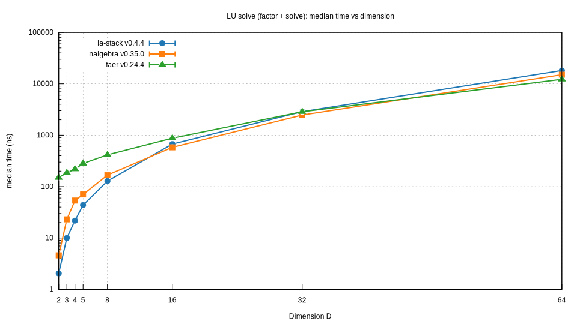

# la-stack

[](https://doi.org/10.5281/zenodo.18158926)
[](https://crates.io/crates/la-stack)
[](https://crates.io/crates/la-stack)
[](./LICENSE)
[](https://docs.rs/la-stack)
[](https://github.com/acgetchell/la-stack/actions/workflows/ci.yml)
[](https://github.com/acgetchell/la-stack/actions/workflows/rust-clippy.yml)
[](https://codecov.io/gh/acgetchell/la-stack)
[](https://github.com/acgetchell/la-stack/actions/workflows/audit.yml)
[](https://github.com/acgetchell/la-stack/actions/workflows/codacy.yml)

Fast, stack-allocated linear algebra for fixed dimensions in Rust.

This crate grew from the need to support [`delaunay`](https://crates.io/crates/delaunay) with fast, stack-allocated linear algebra primitives and algorithms
while keeping the API intentionally small and explicit.

## 📐 Introduction

`la-stack` provides a handful of const-generic, stack-backed building blocks:

- `Vector<const D: usize>` for fixed-length vectors (`[f64; D]` today)
- `Matrix<const D: usize>` for fixed-size square matrices (`[[f64; D]; D]` today)
- `Lu<const D: usize>` for LU factorization with partial pivoting (solve + det)
- `Ldlt<const D: usize>` for LDLT factorization without pivoting (solve + det; symmetric SPD/PSD)

## ✨ Design goals

- ✅ `Copy` types where possible
- ✅ Const-generic dimensions (no dynamic sizes)
- ✅ `const fn` where possible (compile-time evaluation of determinants, dot products, etc.)
- ✅ Explicit algorithms (LU, solve, determinant)
- ✅ Robust geometric predicates via optional exact arithmetic (`det_sign_exact`, `det_errbound`)
- ✅ No runtime dependencies by default (optional features may add deps)
- ✅ Stack storage only (no heap allocation in core types)
- ✅ `unsafe` forbidden

See [CHANGELOG.md](CHANGELOG.md) for details.

## 🚫 Anti-goals

- Bare-metal performance: see [`blas-src`](https://crates.io/crates/blas-src), [`lapack-src`](https://crates.io/crates/lapack-src), [`openblas-src`](https://crates.io/crates/openblas-src)
- Comprehensive: use [`nalgebra`](https://crates.io/crates/nalgebra) if you need a full-featured library
- Large matrices/dimensions with parallelism: use [`faer`](https://crates.io/crates/faer) if you need this

## 🔢 Scalar types

Today, the core types are implemented for `f64`. The intent is to support `f32` and `f64`
(and `f128` if/when Rust gains a stable primitive for it). Arbitrary-precision arithmetic
is available via the optional `"exact"` feature (see below).

## 🚀 Quickstart

Add this to your `Cargo.toml`:

```toml
[dependencies]
la-stack = "0.2.2"
```

Solve a 5×5 system via LU:

```rust
use la_stack::prelude::*;

// This system requires pivoting (a[0][0] = 0), so it's a good LU demo.
// A = J - I: zeros on diagonal, ones elsewhere.
let a = Matrix::<5>::from_rows([
    [0.0, 1.0, 1.0, 1.0, 1.0],
    [1.0, 0.0, 1.0, 1.0, 1.0],
    [1.0, 1.0, 0.0, 1.0, 1.0],
    [1.0, 1.0, 1.0, 0.0, 1.0],
    [1.0, 1.0, 1.0, 1.0, 0.0],
]);

let b = Vector::<5>::new([14.0, 13.0, 12.0, 11.0, 10.0]);

let lu = a.lu(DEFAULT_PIVOT_TOL).unwrap();
let x = lu.solve_vec(b).unwrap().into_array();

// Floating-point rounding is expected; compare with a tolerance.
let expected = [1.0, 2.0, 3.0, 4.0, 5.0];
for (x_i, e_i) in x.iter().zip(expected.iter()) {
    assert!((*x_i - *e_i).abs() <= 1e-12);
}
```

Compute a determinant for a symmetric SPD matrix via LDLT (no pivoting).

For symmetric positive-definite matrices, `LDL^T` is essentially a square-root-free form of the Cholesky decomposition
(you can recover a Cholesky factor by absorbing `sqrt(D)` into `L`):

```rust
use la_stack::prelude::*;

// This matrix is symmetric positive-definite (A = L*L^T) so LDLT works without pivoting.
let a = Matrix::<5>::from_rows([
    [1.0, 1.0, 0.0, 0.0, 0.0],
    [1.0, 2.0, 1.0, 0.0, 0.0],
    [0.0, 1.0, 2.0, 1.0, 0.0],
    [0.0, 0.0, 1.0, 2.0, 1.0],
    [0.0, 0.0, 0.0, 1.0, 2.0],
]);

let det = a.ldlt(DEFAULT_SINGULAR_TOL).unwrap().det();
assert!((det - 1.0).abs() <= 1e-12);
```

## ⚡ Compile-time determinants (D ≤ 4)

`det_direct()` is a `const fn` providing closed-form determinants for D=0–4,
using fused multiply-add where applicable. `Matrix::<0>::zero().det_direct()`
returns `Some(1.0)` (the empty-product convention). For D=1–4, cofactor
expansion bypasses LU factorization entirely. This enables compile-time
evaluation when inputs are known:

```rust
use la_stack::prelude::*;

// Evaluated entirely at compile time — no runtime cost.
const DET: Option<f64> = {
    let m = Matrix::<3>::from_rows([
        [2.0, 0.0, 0.0],
        [0.0, 3.0, 0.0],
        [0.0, 0.0, 5.0],
    ]);
    m.det_direct()
};
assert_eq!(DET, Some(30.0));
```

The public `det()` method automatically dispatches through the closed-form path
for D ≤ 4 and falls back to LU for D ≥ 5 — no API change needed.

## 🔬 Exact arithmetic (`"exact"` feature)

The default build has **zero runtime dependencies**.  Enable the optional
`exact` Cargo feature to add exact determinant methods using adaptive-precision
arithmetic (this pulls in `num-bigint`, `num-rational`, and `num-traits` for
`BigRational`):

```toml
[dependencies]
la-stack = { version = "0.2.2", features = ["exact"] }
```

- **`det_exact()`** — returns the exact determinant as a `BigRational`
- **`det_exact_f64()`** — returns the exact determinant converted to the nearest `f64`
- **`det_sign_exact()`** — returns the provably correct sign (−1, 0, or +1)

```rust,ignore
use la_stack::prelude::*;

let m = Matrix::<3>::from_rows([
    [1.0, 2.0, 3.0],
    [4.0, 5.0, 6.0],
    [7.0, 8.0, 9.0],
]);
assert_eq!(m.det_sign_exact().unwrap(), 0); // exactly singular

let det = m.det_exact().unwrap();
assert_eq!(det, BigRational::from_integer(0.into())); // exact zero
```

`BigRational` is re-exported from the crate root and prelude when the `exact`
feature is enabled, so consumers don't need to depend on `num-rational` directly.

For `det_sign_exact()`, D ≤ 4 matrices use a fast f64 filter (error-bounded
`det_direct()`) that resolves the sign without allocating.  Only near-degenerate
or large (D ≥ 5) matrices fall through to the exact Bareiss algorithm.

### Adaptive precision with `det_errbound()`

`det_errbound()` returns the conservative absolute error bound used by the fast
filter. This method does NOT require the `exact` feature — it uses pure f64
arithmetic and is available by default. This enables building custom
adaptive-precision logic for geometric predicates:

```rust,ignore
use la_stack::prelude::*;

let m = Matrix::<3>::identity();
if let Some(bound) = m.det_errbound() {
    let det = m.det_direct().unwrap();
    if det.abs() > bound {
        // f64 sign is guaranteed correct
        let sign = det.signum() as i8;
    } else {
        // Fall back to exact arithmetic (requires `exact` feature)
        let sign = m.det_sign_exact().unwrap();
    }
} else {
    // D ≥ 5: no fast filter, use exact directly (requires `exact` feature)
    let sign = m.det_sign_exact().unwrap();
}
```

The error coefficients (`ERR_COEFF_2`, `ERR_COEFF_3`, `ERR_COEFF_4`) are also
exposed for advanced use cases.

## 🧩 API at a glance

| Type | Storage | Purpose | Key methods |
|---|---|---|---|
| `Vector<D>` | `[f64; D]` | Fixed-length vector | `new`, `zero`, `dot`, `norm2_sq` |
| `Matrix<D>` | `[[f64; D]; D]` | Square matrix | `lu`, `ldlt`, `det`, `det_direct`, `det_errbound`, `det_exact`¹, `det_exact_f64`¹, `det_sign_exact`¹ |
| `Lu<D>` | `Matrix<D>` + pivot array | Factorization for solves/det | `solve_vec`, `det` |
| `Ldlt<D>` | `Matrix<D>` | Factorization for symmetric SPD/PSD solves/det | `solve_vec`, `det` |

Storage shown above reflects the current `f64` implementation.

¹ Requires `features = ["exact"]`.

## 📋 Examples

The `examples/` directory contains small, runnable programs:

- **`solve_5x5`** — solve a 5×5 system via LU with partial pivoting
- **`det_5x5`** — determinant of a 5×5 matrix via LU
- **`const_det_4x4`** — compile-time 4×4 determinant via `det_direct()`
- **`exact_det_3x3`** — exact determinant value of a near-singular 3×3 matrix (requires `exact` feature)
- **`exact_sign_3x3`** — exact determinant sign of a near-singular 3×3 matrix (requires `exact` feature)

```bash
just examples
# or individually:
cargo run --example solve_5x5
cargo run --example det_5x5
cargo run --example const_det_4x4
cargo run --features exact --example exact_det_3x3
cargo run --features exact --example exact_sign_3x3
```

## 🤝 Contributing

A short contributor workflow:

```bash
cargo install just
just setup        # install/verify dev tools + sync Python deps
just check        # lint/validate (non-mutating)
just fix          # apply auto-fixes (mutating)
just ci           # lint + tests + examples + bench compile
```

For the full set of developer commands, see `just --list` and `AGENTS.md`.

## 📝 Citation

If you use this library in academic work, please cite it using [CITATION.cff](CITATION.cff) (or GitHub's
"Cite this repository" feature). A Zenodo DOI will be added for tagged releases.

## 📚 References

For canonical references to the algorithms used by this crate, see [REFERENCES.md](REFERENCES.md).

## 📊 Benchmarks (vs nalgebra/faer)



Raw data: [docs/assets/bench/vs_linalg_lu_solve_median.csv](docs/assets/bench/vs_linalg_lu_solve_median.csv)

Summary (median time; lower is better). The “la-stack vs nalgebra/faer” columns show the % time reduction relative to each baseline (positive = la-stack faster):

<!-- BENCH_TABLE:lu_solve:median:new:BEGIN -->
| D | la-stack median (ns) | nalgebra median (ns) | faer median (ns) | la-stack vs nalgebra | la-stack vs faer |
|---:|--------------------:|--------------------:|----------------:|---------------------:|----------------:|
| 2 | 2.013 | 4.405 | 139.352 | +54.3% | +98.6% |
| 3 | 14.795 | 23.172 | 179.562 | +36.2% | +91.8% |
| 4 | 27.752 | 53.273 | 209.677 | +47.9% | +86.8% |
| 5 | 47.390 | 72.950 | 269.797 | +35.0% | +82.4% |
| 8 | 134.480 | 164.243 | 362.668 | +18.1% | +62.9% |
| 16 | 608.460 | 582.134 | 865.103 | -4.5% | +29.7% |
| 32 | 2,649.763 | 2,762.180 | 2,874.740 | +4.1% | +7.8% |
| 64 | 17,511.169 | 14,424.833 | 12,461.534 | -21.4% | -40.5% |
<!-- BENCH_TABLE:lu_solve:median:new:END -->

## 📄 License

BSD 3-Clause License. See [LICENSE](./LICENSE).
